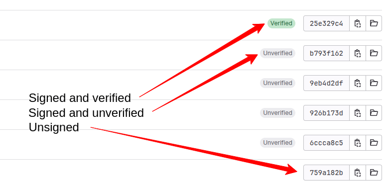

# Setting Up the Foundation: The Git Setup


## Configuring the Git Repository


```bash
cd $HOME/RestQR
git init
```


```bash
# Ignore Python unnecessary files
curl https://raw.githubusercontent.com/github/gitignore/master/Python.gitignore \
    > $HOME/RestQR/.gitignore

# Ignore Terraform unnecessary files
curl https://raw.githubusercontent.com/github/gitignore/refs/heads/main/Terraform.gitignore \
    >> $HOME/RestQR/.gitignore
```


```bash
git checkout -b main
```


```bash
git config --global user.email "admin@restqr.app"
git config --global user.name "RestQR"
```


```bash
cat <<EOF >>~/.bashrc && source ~/.bashrc
export GITLAB_API_TOKEN="<CHANGE_ME>"
EOF
```


```bash
# Add WakeMeOps repository
curl -sSL \
    "https://raw.githubusercontent.com/upciti/wakemeops/main/assets/install_repository" | \
    bash

# Install glab
apt install glab -y
```


```bash
glab auth login \
    --hostname gitlab.com \
    --token $GITLAB_API_TOKEN
```


```bash
glab auth status
```


```bash
ssh-keygen -t rsa -b 4096 \
    -C "admin@restqr.app" \
    -f ~/.ssh/id_rsa -N ""
```


```bash
glab ssh-key add \
    ~/.ssh/id_rsa.pub \
    -t "RestQR"
```


```bash
# Change the values based on your preferences and available names
cat <<EOF >>~/.bashrc && source ~/.bashrc
export GITLAB_INSTANCE=gitlab.com
export GITLAB_GROUP=RestQR
export GITLAB_PROJECT=RestQR
EOF
```


```bash
# Cd into the RestQR folder
cd $HOME/RestQR

# Create a new GitLab repository
glab repo create \
    --name $GITLAB_PROJECT \
    --group $GITLAB_GROUP \
    --description "RestQR application" \
    --private
```


```bash
git remote -v
```


```bash
git add .
git commit -m "Initial commit"
git push origin main
```


```bash
echo "https://$GITLAB_INSTANCE/$GITLAB_GROUP/$GITLAB_PROJECT"
```


## General Git Security Considerations


### Access Control and Unauthorized Access


### Branch Protection


### Tags and Releases


### Unsigned Commits and Commit Signing


```bash
git config --global user.email "sofia@restqr.com
git config --global user.name "Sofia"
git commit -m "This is a commit from Sofia"
```


```bash
gpg --list-secret-keys
```


```bash
export REAL_NAME="<YOUR_REAL_NAME>"
export EMAIL="<YOUR_EMAIL>"
```


```bash
gpg --full-gen-key --batch <( \
    echo "Key-Type: 1"; \
    echo "Key-Length: 4096"; \
    echo "Subkey-Type: 1"; \
    echo "Subkey-Length: 4096"; \
    echo "Expire-Date: 0"; \
    echo "Name-Real: $REAL_NAME"; \
    echo "Name-Email: $EMAIL"; \
    echo "%no-protection"; )
```


```bash
gpg --list-secret-keys --keyid-format LONG $EMAIL
```


```plaintext
sec   rsa4096/4AB65574279303ED 2025-03-21 [SCEAR]
      BE9988E5C86F392320406F944AB65574279303ED
uid                 [ultimate] Sofia <sofia@restqr.com>
ssb   rsa4096/7D3D8C7A2FD81B94 2025-03-21 [SEA]
```


```bash
export KEY_ID="<KEY_ID>"
```


```bash
gpg --armor --export $KEY_ID
```


```bash
# Sign all commits by default in all repositories
git config --global user.signingkey $KEY_ID
git config --global commit.gpgsign true
```


```bash
# Create a new file and add some content
echo $(date) > test.txt

# Add the file to the staging area
git add test.txt

# If you've already configured git to always sign commits with:
# git config --global commit.gpgsign true
# git config --global user.signingkey <KEY_ID>
# Then you can omit the `-S` option:
git commit -m "Test commit" -S

# Verify the commit signature
git log --show-signature

# Push the commit to the remote repository
git push origin main
```




### Passwordless Authentication


```bash
git remote -v
```


```bash
# Already done by the glab command
git remote set-url \
    origin git@$GITLAB_INSTANCE:$GITLAB_GROUP/$GITLAB_PROJECT.git
```