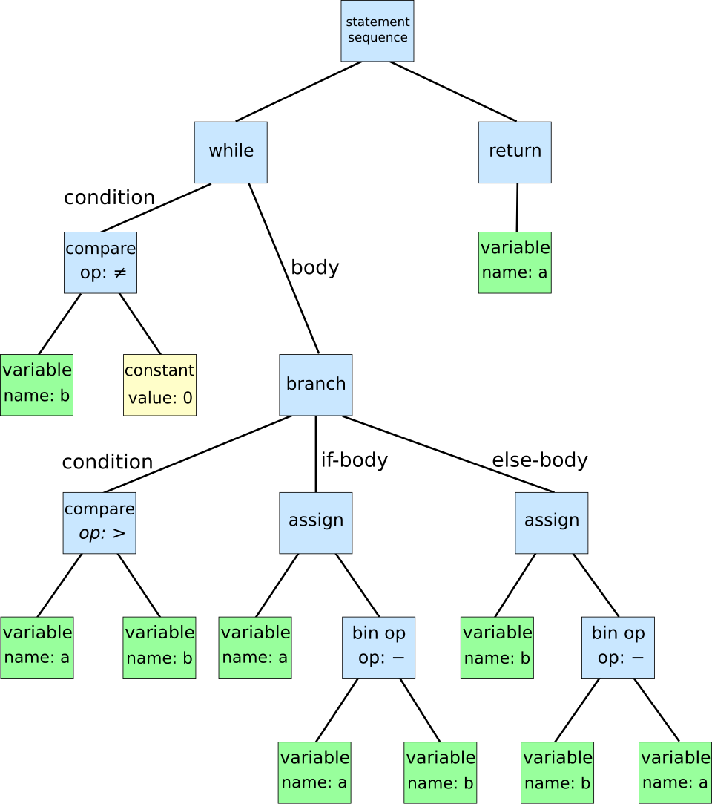

# Code Quality and Security Linting


## The Importance of Code Quality and Security


## Understanding Abstract Syntax Trees (ASTs)


```python
while b != 0:
    if a > b:
        a = a - b
    else:
        b = b - a
return a
```




```python
# Run a python script from the command line
python3 <<END
import ast

code = """
while b != 0:
    if a > b:
        a = a - b
    else:
        b = b - a
return a
"""

tree = ast.parse(code)
# Pretty-printed output of the AST
print(ast.dump(tree, indent=4))
END
```


## Common Code Security Pitfalls


### Hardcoded Secrets and Credentials


```python
# Hardcoded API key
API_KEY = "my-super-secret-api-key"  
# Hardcoded database password
DB_PASSWORD = "password123"  
```


```python
import os
# Fetch from environment variables
API_KEY = os.getenv("API_KEY")  
# Fetch from a secure vault
DB_PASSWORD = os.getenv("DB_PASSWORD")  
```


### SQL Injection Vulnerabilities


```python
import sqlite3

def get_user(username):
    conn = sqlite3.connect("users.db")
    cursor = conn.cursor()
    query = f"SELECT * FROM users WHERE username = '{username}'"
    # Dangerous: vulnerable to SQL injection
    cursor.execute(query)  
    return cursor.fetchall()
```


```python
import sqlite3

def get_user(username):
    conn = sqlite3.connect("users.db")
    cursor = conn.cursor()
    query = "SELECT * FROM users WHERE username = ?"
    # Parameterized query prevents SQL injection
    cursor.execute(query, (username,))  
    return cursor.fetchall()
```


### Insufficient Input Validation


```python
import os

def execute_command(user_input):
    # Dangerous: could allow arbitrary command execution
    os.system("echo " + user_input)
```


```python
import shlex, subprocess

def execute_command(user_input):
    # Sanitize input
    safe_input = shlex.quote(user_input)  
    subprocess.run(["echo", safe_input], check=True)
```


```bash
echo '; rm -rf some_folder;'
```


### Improper Error Handling and Information Disclosure


```python
try:
    result = 1 / 0
except Exception as e:
    # Reveals system information
    print("Error:", e)
```


```python
import logging

logging.basicConfig(level=logging.ERROR)
logger = logging.getLogger("app")

try:
    result = 1 / 0
except Exception:
    # Logs securely without exposing details
    logger.error("An error occurred", exc_info=True)  
```


### Use of Insecure Deserialization


```python
import pickle

def load_user_data(data):
    # Dangerous: can execute arbitrary code
    return pickle.loads(data)  
```


```python
import json

def load_user_data(data):
    # Safer alternative using JSON
    return json.loads(data)  
```


### Weak Cryptographic Practices


```python
import hashlib

password = "mypassword"
# MD5 is weak and insecure
hashed_password = hashlib.md5(password.encode()).hexdigest()  
```


```python
import bcrypt

password = "mypassword"
# Strong hashing
hashed_password = bcrypt.hashpw(password.encode(), bcrypt.gensalt())  
```


### Exposing Sensitive Data in Logs


```python
import logging

logging.basicConfig(level=logging.INFO)
# Logs sensitive data
logging.info("User logged in with password: mypassword")  
```


```python
import logging

logging.basicConfig(level=logging.INFO)
# Avoids logging sensitive data
logging.info("User logged in")  
```


### Insufficient Access Controls


```python
@app.route("/admin")
def admin_dashboard():
    # No authentication required - anyone can access!
    return "Admin Panel"
```


```python
from flask import abort

@app.route("/admin")
# Requires authentication using the right decorator
@login_required
def admin_dashboard():    
    return "Admin Panel"
```


## Bandit: A Security Linter from Python Code Quality Authority (PyCQA)


```bash
# Activate the virtual environment
workon menu

# Install Bandit
pip install bandit==1.8.3
```


```bash
bandit -r $HOME/RestQR/
```


```python
app.run(host="0.0.0.0", port=5001, debug=True)
```


```bash
>> Issue: [B201:flask_debug_true] A Flask app appears to be run with debug=True, which exposes the Werkzeug debugger and allows the execution of arbitrary code.
   Severity: High   Confidence: Medium
   CWE: CWE-94 (https://cwe.mitre.org/data/definitions/94.html)
   More Info: https://bandit.readthedocs.io/en/1.8.3/plugins/b201_flask_debug_true.html
   Location: /root/RestQR/qr/app.py:30:4
29	if __name__ == "__main__":
30	    app.run(host="0.0.0.0", port=5001, debug=True)

--------------------------------------------------
>> Issue: [B104:hardcoded_bind_all_interfaces] Possible binding to all interfaces.
   Severity: Medium   Confidence: Medium
   CWE: CWE-605 (https://cwe.mitre.org/data/definitions/605.html)
   More Info: https://bandit.readthedocs.io/en/1.8.3/plugins/b104_hardcoded_bind_all_interfaces.html
   Location: /root/RestQR/qr/app.py:30:17
29	if __name__ == "__main__":
30	    app.run(host="0.0.0.0", port=5001, debug=True)
```


```ini
[tool.bandit]
# List of target folders to scan
targets = ["menu", "qr"]
# List of directories and files to exclude
exclude_dirs = ["tests", "venv"]
# List of tests to run
tests = ["B201", "B301"]
# List of tests to skip
skips = ["B101", "B601"]
```


```python
# This line will not trigger Bandit issues
app.run(host="0.0.0.0", port=5001, debug=True)  # nosec
```


## Security Linting Alternatives