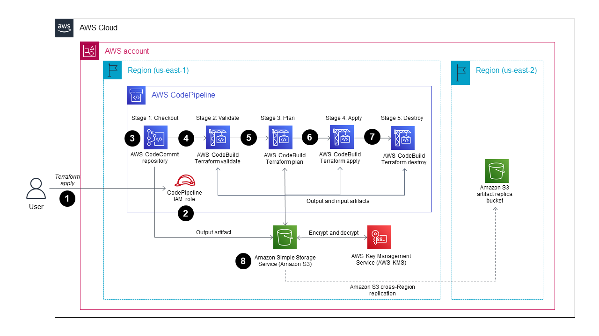

# IaC, Security and Secure Collaboration


## Security Best Practices


### Manage Secrets Securely


### Implement Role-Based Access Control (RBAC) and Least Privilege


### Use Secure Remote State Storage and Locking


### Mitigate Drift and Enforce Compliance


```javascript
// Sentinel policy to prevent open security groups in AWS
import "tfplan/v2" as tfplan
 
security_groups = filter tfplan.resource_changes as _, rc {
	rc.mode is "managed" and
		rc.type is "aws_security_group" and
		rc.change.actions is not ["delete"]
}
 
main = rule {
	all security_groups as _, sg {
		all sg.change.after.egress as egress {
			egress.cidr_blocks not contains "0.0.0.0/0"
		}
	}
}
```




## Versioning Best Practices and Security


### Use Git and a Clear Workflow


### Manage Provider Versions with Lock Files


### Structure Repositories and Modules Logically 


### Track and Review Changes with Plans