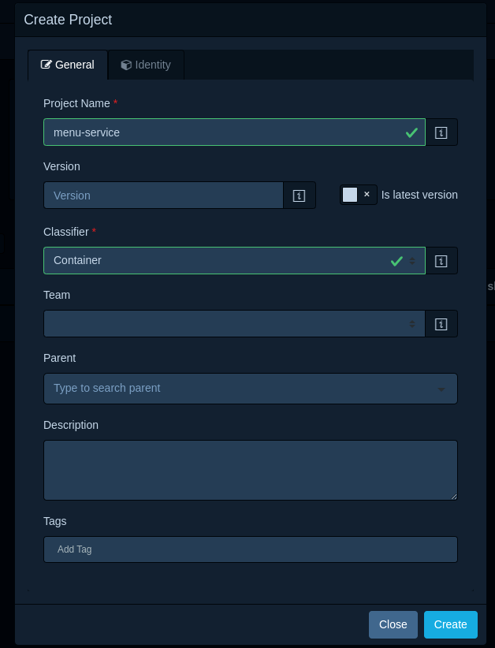
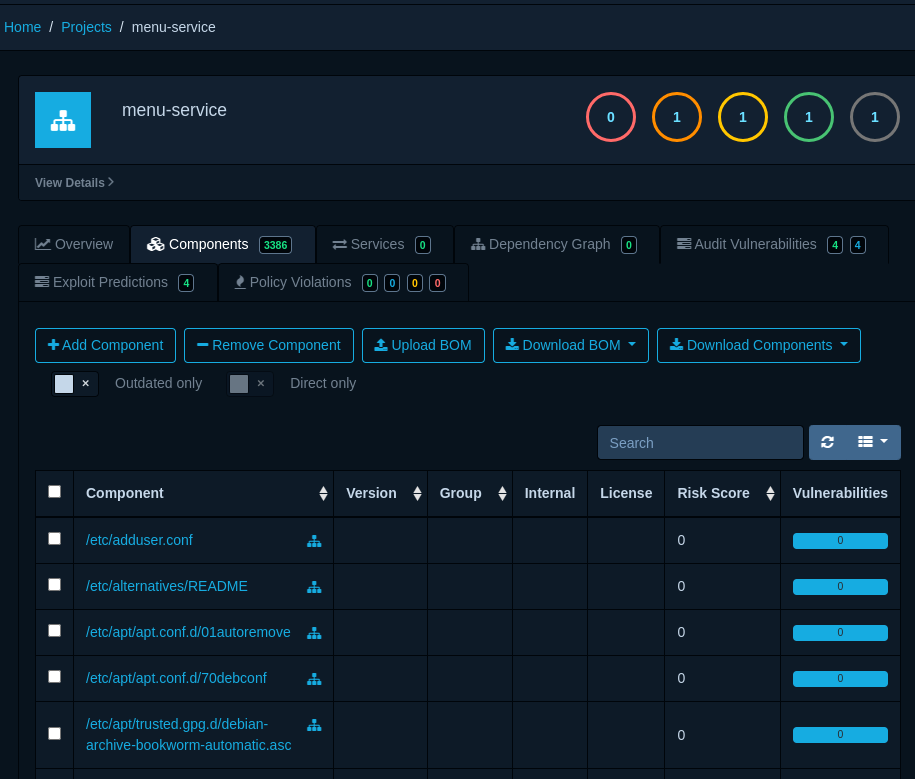
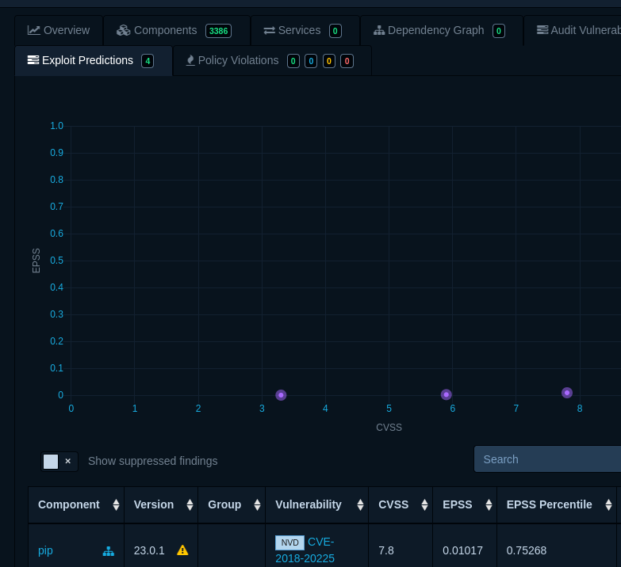

# Software Bill of Materials and Supply Chain Security


## The Growing Importance of Software Supply Chain Security


## Understanding the Software Bill of Materials (SBOM)


## The Intersection of SBOMs and DevSecOps


## Using Syft for Docker Image Analysis


```bash
curl -sSfL \
    https://raw.githubusercontent.com/anchore/syft/main/install.sh | \
    sh -s -- -b /usr/local/bin
```


```bash
syft <image>
```


```bash
syft registry.gitlab.com/restqr/restqr/menu-service:v0.1.0
```


```bash
NAME                    VERSION                TYPE                    
[...]
bash                    5.2.15                 binary                   
bash                    5.2.15-2+b7            deb                      
blinker                 1.9.0                  python                   
bsdutils                1:2.38.1-5+deb12u3     deb                      
ca-certificates         20230311               deb                      
click                   8.1.8                  python                   
coreutils               9.1-1                  deb                      
dash                    0.5.12-2               deb                      
debconf                 1.5.82                 deb                      
debian-archive-keyring  2023.3+deb12u1         deb                      
debianutils             5.7-0.5~deb12u1        deb                      
diffutils               1:3.8-4                deb                      
dpkg                    1.21.22                deb                      
e2fsprogs               1.47.0-2               deb                      
findutils               4.9.0-4                deb                      
flask                   3.1.0                  python                   
flask-sqlalchemy        3.1.1                  python 
[...]
```


```bash
# JSON output
syft registry.gitlab.com/restqr/restqr/menu-service:v0.1.0 \
    -o json

# SPDX output
syft registry.gitlab.com/restqr/restqr/menu-service:v0.1.0 \
    -o spdx

# CycloneDX output
syft registry.gitlab.com/restqr/restqr/menu-service:v0.1.0 \
    -o cyclonedx
```


```bash
syft <image> --scope all-layers
```


## Syft and OWASP DependencyTrack: Putting SBOMs to Work


```bash
# Generate CycloneDX SBOM for the menu-service image
syft registry.gitlab.com/restqr/restqr/menu-service:v0.1.0 \
    -o cyclonedx > $HOME/menu-service-bom.xml
```


```bash
# Create a directory for DependencyTrack
mkdir $HOME/RestQR/deploy/dependencytrack

# Download the Docker Compose file
curl -L \
    https://dependencytrack.org/docker-compose.yml \
    -o $HOME/RestQR/deploy/dependencytrack/docker-compose.yml    
```


```yaml
[...]
  frontend:
    image: dependencytrack/frontend
    depends_on:
      apiserver:
        condition: service_healthy
    environment:
      # The base URL of the API server.
      # NOTE:
      #   * This URL must be reachable by the browsers of your users.
      #   * The frontend container itself does NOT communicate with the API server directly, it just serves static files.
      #   * When deploying to dedicated servers, please use the external IP or domain of the API server.
      API_BASE_URL: "http://161.35.75.172:8081/"
      # OIDC_ISSUER: ""
      # OIDC_CLIENT_ID: ""
      # OIDC_SCOPE: ""
      # OIDC_FLOW: ""
      # OIDC_LOGIN_BUTTON_TEXT: ""
      # volumes:
      # - "/host/path/to/config.json:/app/static/config.json"
    ports:
      - "8080:8080"
    restart: unless-stopped

[...]
```


```yaml
[...]
  apiserver:
    image: dependencytrack/apiserver
    depends_on:
      postgres:
        condition: service_healthy
    environment:
      ALPINE_DATABASE_MODE: "external"
      ALPINE_DATABASE_URL: "jdbc:postgresql://postgres:5432/dtrack"
      ALPINE_DATABASE_DRIVER: "org.postgresql.Driver"
      ALPINE_DATABASE_USERNAME: "dtrack"
      ALPINE_DATABASE_PASSWORD: "dtrack"
      EXTRA_JAVA_OPTIONS: "-Xmx4G"
    deploy:
      resources:
        limits:
          memory: 12288m
        reservations:
          memory: 8192m
      restart_policy:
        condition: on-failure
    ports:
    - '8081:8080'
    volumes:
    - 'dtrack-data:/data'
    restart: unless-stopped
[...]
```


```bash
# Start DependencyTrack
cd $HOME/RestQR/deploy/dependencytrack
docker compose up -d
```


```
echo "http://$(curl -s ifconfig.me):8080"
```








## Conclusion