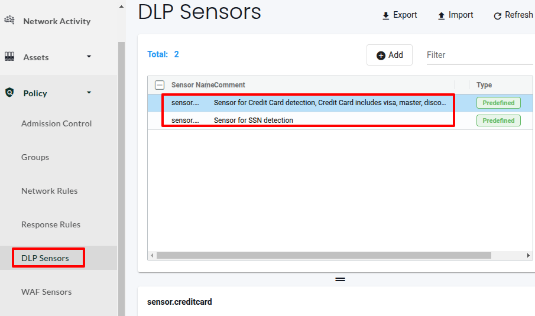

# Shifting Left with Security Policy as Code (SPaC)


## Static Security (SAST), Dynamic Security (DAST) and Shifting Left


## Introduction to NeuVector


## NeuVector: Installation and Configuration


```bash
helm repo add neuvector \
  https://neuvector.github.io/neuvector-helm/
```


```bash
kubectl create namespace neuvector
```


```bash
kubectl label namespace neuvector \
  "pod-security.kubernetes.io/enforce=privileged"
```


```bash
helm upgrade --install neuvector neuvector/core \
  --namespace neuvector \
  --set tag=5.4.2 \
  --set enforcer.privileged=true \
  --set containerd.enabled=true \
  --set containerd.path="/run/containerd/containerd.sock"
```


```bash
# Forwards the NeuVector console to localhost:8443 and sends the job to the background
nohup kubectl port-forward svc/neuvector-service-webui \
    8443:8443 -n neuvector \
    > port-forward.log 2>&1 &
```


```bash
export USERNAME=<USERNAME>
export REMOTE_SERVER_IP=<REMOTE_SERVER_IP>

# Create an SSH tunnel to the remote server
ssh -NfL 8443:localhost:8443 \
  $USERNAME@$REMOTE_SERVER_IP
```


```bash
kubectl get pods -n neuvector
```


## Compliance and Auditing


## Vulnerability Management


```bash
kubectl create deployment juice-shop --image=bkimminich/juice-shop --port=3000
kubectl expose deployment juice-shop --type=NodePort --port=3000
```


### The Network Activity Dashboard


### Groups and Policies: Discover, Monitor, Protect


```bash
# Restaurant ID 3 (Mediteranean)
curl -X POST -H "Content-Type: application/json" -d '{
    "menu": [
        {
            "name": "Greek Salad",
            "price": 10
        },
        {
            "name": "Zaatar",
            "price": 8
        },
        {
            "name": "Couscous",
            "price": 5
        }
    ]
}' http://menu.$INGRESS_IP.sslip.io/menu/3

# QR code for the mediterranean Restaurant
curl http://qr.$INGRESS_IP.sslip.io/qr/3 \
  -o /tmp/qr-mediteranean.png
```


```bash
# Update the package list
kubectl exec -it \
  $(kubectl get pods -l app=menu -o jsonpath='{.items[0].metadata.name}') \
  -- apt-get update

# Install iputils-ping
kubectl exec -it \
  $(kubectl get pods -l app=menu -o jsonpath='{.items[0].metadata.name}') \
  -- apt-get install -y iputils-ping
```


## Security Policy as Code (SPaC): Shifting Security Left


```yaml
apiVersion: v1
kind: List
items:
    # API version for NeuVector CRDs
  - apiVersion: neuvector.com/v1  
    # Kind of object representing a security rule in NeuVector
    kind: NvSecurityRule
    metadata:      
      # Name of the rule; typically matches the group name
      name: nv.menu.default             
    spec:
      # Data Loss Prevention (DLP) settings
      dlp:
        settings: []
        status: true
      # Outbound traffic rules (Egress) configuration
      egress:
        # First egress rule allows PostgreSQL communication
        - action: allow
          applications:
            # The application associated with this rule
            - PostgreSQL         
          # Name of the egress rule
          name: nv.menu-postgresql.default-egress-0  
          # Specifies that the rule applies to all ports
          ports: any             
          # Rule priority (lower number means higher priority)
          priority: 0            
          selector:
            # Criteria to match traffic for this rule
            criteria:            
              - key: service
                op: =
                value: menu-postgresql.default
              - key: domain
                op: =
                value: default
            # The target group for this rule
            name: nv.menu-postgresql.default  
      
        # Second egress rule allows DNS communication
        [... truncated]
      
      # File access rules configuration; 
      # empty list indicates no file rules defined
      file: []
      
      # Inbound traffic rules (Ingress) configuration
      ingress:
        # First ingress rule allows HTTP traffic from the ingress workload
        - action: allow
          applications:
            # The application associated with this rule
            - HTTP             
          # Name of the ingress rule
          name: nv.menu.default-ingress-0  
          ports: any
          priority: 0
          selector:
            comment: ""
            # Matches traffic coming from the ingress workload
            name: Workload:ingress  
            original_name: ""
        # Second ingress rule allows HTTP traffic from a specific ingress-nginx controller
        [... truncated]
      
      # Process rules configuration
      process:
        # Allow the pause process; this is a placeholder container process used by Kubernetes
        - action: allow
          allow_update: false   # Indicates that updates to this rule are not permitted
          name: pause
          path: /pause
        # Allow the python process running at the specified path
        - action: allow
          allow_update: false
          name: python
          path: /usr/local/bin/python3.9
      
      [... truncated]
```


## WAF: Web Application Firewall


```bash
# This request should not be blocked
while true; do curl -ILkv -H "Pass: 123456"  \
  http://wordpress.167.99.244.81.sslip.io/wp-login.php; sleep 2; done;

# This request should be blocked
while true; do curl -ILkv -H "Pass: 654321"  \
  http://wordpress.167.99.244.81.sslip.io/wp-login.php; sleep 2; done;
```


## DLP Sensors: Protecting Sensitive Data


```yaml
[...]

  spec:
    dlp:
      settings: []
      status: true

[...]
```


```bash
\b(?!\b(\d)\1+-?(\d)\1+-?(\d)\1+\b)(?!123-?45-?6789|219-?09-?9999|078-?05-?1120)(?!666|000|9\d{2})\d{3}-?(?!00)\d{2}-?(?!0{4})\d{4}\b
```




## WAF: Web Application Firewall


```bash
# Add the Bitnami repository
helm repo add bitnami https://charts.bitnami.com/bitnami

# Install the WordPress Helm chart
helm upgrade --install my-wordpress bitnami/wordpress \
  --version 24.1.5 \
  --namespace my-wordpress \
  --create-namespace \
  --set mariadb.architecture=replication \
  --set replicaCount=2 \
  --set ingress.enabled=true \
  --set ingress.ingressClassName=nginx \
  --set ingress.hostname=wordpress.$INGRESS_IP.sslip.io
```


```bash
# This request should not be blocked
while true; do curl -ILkv -H "Pass: 123456"  \
  http://wordpress.$INGRESS_IP.sslip.io/wp-login.php; \
  sleep 2; done;

# This request should be blocked
while true; do curl -ILkv  \
  http://wordpress.$INGRESS_IP.sslip.io/wp-login.php; \
  sleep 2; done;
```


## Response Rules: Active Defense and Incident Response


```bash
# Install ngrok if you haven't already
# https://ngrok.com/downloads/
ngrok http 3000
```


```python
cat <<EOF > /tmp/webhook.py
# Import necessary modules from Flask
from flask import Flask, request

# Initialize the Flask application
app = Flask(__name__)

# Define a route that catches all paths and methods
@app.route('/', defaults={'path': ''}, methods=['GET', 'POST', 'PUT', 'DELETE', 'PATCH'])
@app.route('/<path:path>', methods=['GET', 'POST', 'PUT', 'DELETE', 'PATCH'])
def catch_all(path):
    # Print the HTTP method used
    print(f"Method: {request.method}")

    # Print the requested path
    print(f"Path: /{path}")

    # Print all request headers
    print(f"Headers: {dict(request.headers)}")

    # Print the request body
    print(f"Body: {request.get_data()}")

    # Respond to the client
    return "Request received", 200

# Run the Flask app on all available IPs on port 300
if __name__ == '__main__':
    app.run(host='0.0.0.0', port=3000)
EOF
```


```bash
python3 /tmp/webhook.py
```


```json
{
  "level": "CRITICAL",
  "cluster": "cluster.local",
  "comment": "Trigger a webhook whenever someone is visiting /wp-login.php without the right header",
  "name": "WAF.sensors.wp-admin.BlockAdminAccess",
  "level": "Critical",
  "cluster_name": "cluster.local",
  "response_rule_id": 8,
  "host_id": "rke2-master:f2041650-b334-45c2-9575-f3a42d0e6858",
  "host_name": "rke2-master",
  "enforcer_id": "704a4ec457d456456194fcc31ca324eae017c21da4ae034875adcfade5c544e9",
  "enforcer_name": "neuvector-enforcer-pod-hcxrt",
  "threat_id": 40003,
  "client_workload_id": "XXX.XXX.XXX.XXX",
  "client_workload_name": "XXX.XXX.XXX.XXX",
  "server_workload_name": "my-wordpress-6769ff64bd-297mb",
  "server_workload_domain": "my-wordpress",
  "severity": "Critical",
  "action": "deny",
  "count": 1,
  "client_ip": "XXX.XXX.XXX.XXX",
  "server_ip": "XXX.XXX.XXX.XXX",
  "sensor": "sensors.wp-admin",
  "group": "nv.my-wordpress.my-wordpress",
  "target": "server",
  "message": "WAF: id 40003"
  [...]
  [...]
}
```