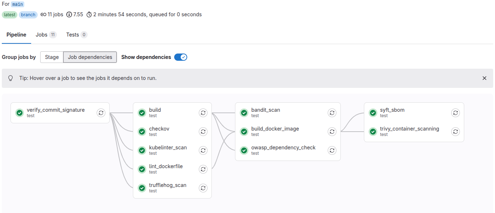

# Putting It All Together — From Practices to Pipelines


## The Big Picture: DevSecOps Is Not a Toolchain — It’s a System


### Key Principles to Operationalize


## CI/CD as the Backbone of DevSecOps


## Building a DevSecOps Pipeline




```bash
# Export each key
gpg --export --armor KEYID1 > dev1.asc
gpg --export --armor KEYID2 > dev2.asc
gpg --export --armor KEYID3 > dev3.asc

# Combine them into one and encode it in base64
cat dev1.asc dev2.asc dev3.asc > devs.key

# Base64 encode the keyring for GitLab CI/CD
cat devs.key | base64 -w0 > devs.key.base64
```


### Verifying the Commit Signature


```yaml
cat <<'EOF' > $HOME/RestQR/.gitlab-ci.yml
# Verify commit signature
# If the commit is not signed, the job will fail
verify_commit_signature:
  allow_failure: true  # Do not fail the whole pipeline if this fails (can be set to false for stricter policies)
  image: alpine:latest
  before_script:
    - apk add --no-cache git gnupg  # Install Git and GPG
    - echo "$GPG_KEYRING" | base64 -d > /tmp/devs.key  # Decode and save GPG keyring
    - gpg --import /tmp/devs.key  # Import GPG keys
  script:
    - echo "Verifying commit signature for $CI_COMMIT_SHA"
    - |
      if git verify-commit "$CI_COMMIT_SHA"; then
        echo "Commit is GPG signed and verified."
      else
        echo "Commit is NOT signed or signature is invalid."
        exit 1
      fi
EOF
```


### Building the Application


```yaml
cat <<'EOF' >> $HOME/RestQR/.gitlab-ci.yml
# Set up a Python virtual environment and install project dependencies
build:
  allow_failure: true
  image: python:3.10
  script:
    - python -m venv venv  # Create virtual environment
    - source venv/bin/activate
    - pip install --upgrade pip
    - pip install -r menu/requirements.txt  # Install required Python packages
  artifacts:
    name: "menu-env"
    paths:
      - venv/
  needs: [verify_commit_signature] 
EOF
```


### Scanning for Secrets Using TruffleHog


```yaml
cat <<'EOF' >> $HOME/RestQR/.gitlab-ci.yml
# Scan the repository for secrets using TruffleHog
trufflehog_scan:
  allow_failure: true
  image: alpine:latest
  before_script:
    - apk add --no-cache git curl jq  # Install required tools
    - curl -sSfL https://raw.githubusercontent.com/trufflesecurity/trufflehog/main/scripts/install.sh | sh -s -- -b /usr/local/bin  # Install TruffleHog
  script:
    - trufflehog filesystem . --only-verified --json | tee trufflehog-results.json | jq
  artifacts:
    paths:
      - trufflehog-results.json
    when: always
  needs: [verify_commit_signature]
EOF
```


### Scanning for Vulnerable Dependencies Using OWASP Dependency-Check


```yaml
cat <<'EOF' >> $HOME/RestQR/.gitlab-ci.yml
# Perform dependency vulnerability analysis using OWASP Dependency-Check
owasp_dependency_check:
  allow_failure: true
  image:
    name: registry.gitlab.com/gitlab-ci-utils/docker-dependency-check:4.4.0
    entrypoint: [""]
  script:
    - >
      /usr/share/dependency-check/bin/dependency-check.sh --scan "./" --format ALL
      --project "$CI_PROJECT_NAME" --nvdApiKey $NVD_API_KEY --failOnCVSS 0  # Fail if any vulnerability found
  artifacts:
    when: always
    paths:
      - "./dependency-check-report.html"
      - "./dependency-check-report.json"
  needs: [verify_commit_signature, build]
EOF
```


### Scanning for Python Security Issues Using Bandit


```yaml
cat <<'EOF' >> $HOME/RestQR/.gitlab-ci.yml
# Scan Python code with Bandit for security issues
bandit_scan:
  allow_failure: true
  image: python:3.10
  script:
    - source venv/bin/activate
    - pip install bandit==1.8.3
    - bandit -r . -f html -o bandit-report.html || true  # Run Bandit and save HTML report
  artifacts:
    paths:
      - bandit-report.html
  needs: [verify_commit_signature, build]
EOF
```


### Linting the Dockerfile Using Hadolint


```yaml
cat <<'EOF' >> $HOME/RestQR/.gitlab-ci.yml
# Lint Dockerfile with Hadolint
lint_dockerfile:
  allow_failure: true
  image: hadolint/hadolint:v2.12.0-debian
  script:
    - hadolint -f json menu/Dockerfile > hadolint-report.json || true  # Save linting results as JSON
  artifacts:
    name: "$CI_JOB_NAME artifacts from $CI_PROJECT_NAME on $CI_COMMIT_REF_SLUG"
    paths:
      - hadolint-report.json
  needs: [verify_commit_signature]
EOF
```


### Building and Pushing the Docker Image


```yaml
cat <<'EOF' >> $HOME/RestQR/.gitlab-ci.yml
# Build and push Docker image to registry
build_docker_image:
  allow_failure: true
  image: docker:latest
  services:
    - docker:dind  # Enable Docker-in-Docker
  script:
    - echo "$CI_REGISTRY_PASSWORD" | docker login $CI_REGISTRY -u $CI_REGISTRY_USER --password-stdin
    - cd menu
    - docker build -t $CI_REGISTRY_IMAGE:$CI_COMMIT_SHA .
    - docker push $CI_REGISTRY_IMAGE:$CI_COMMIT_SHA
  needs: [verify_commit_signature, build, lint_dockerfile]
EOF
```


### Scanning the Docker Image for Vulnerabilities Using Trivy


```yaml
cat <<'EOF' >> $HOME/RestQR/.gitlab-ci.yml
# Scan Docker image using Trivy for vulnerabilities
trivy_container_scanning:
  allow_failure: true
  image: alpine:3.11
  variables:
    GIT_STRATEGY: none
    IMAGE: "$CI_REGISTRY_IMAGE:$CI_COMMIT_SHA"
  before_script: |
    export TRIVY_VERSION=${TRIVY_VERSION:-v0.19.2}
    apk add --no-cache curl docker-cli
    curl -sfL https://raw.githubusercontent.com/aquasecurity/trivy/main/contrib/install.sh | sh -s -- -b /usr/local/bin ${TRIVY_VERSION}
    curl -sSL -o /tmp/trivy-gitlab.tpl https://github.com/aquasecurity/trivy/raw/${TRIVY_VERSION}/contrib/gitlab.tpl
    docker login $CI_REGISTRY -u "$CI_REGISTRY_USER" -p "$CI_REGISTRY_PASSWORD"
  script:
    - |
      trivy \
        --exit-code 0 \
        --cache-dir .trivycache/ \
        --no-progress \
        --format template \
        --template "@/tmp/trivy-gitlab.tpl" \
        -o gl-container-scanning-report.json \
        "$IMAGE"
  cache:
    paths:
      - .trivycache/
  artifacts:
    reports:
      container_scanning: gl-container-scanning-report.json
    paths:
      - gl-container-scanning-report.json
  needs: [verify_commit_signature, build_docker_image]
EOF
```


### Scanning the Terraform Files for Security Issues Using Checkov


```yaml
cat <<'EOF' >> $HOME/RestQR/.gitlab-ci.yml
# Scan Terraform configuration using Checkov
checkov:
  allow_failure: true
  image:
    name: bridgecrew/checkov:latest
    entrypoint:
      - '/usr/bin/env'
      - 'PATH=/usr/local/sbin:/usr/local/bin:/usr/sbin:/usr/bin:/sbin:/bin'
  script:
    - cd deploy/terraform
    - checkov -d . -o json > $CI_PROJECT_DIR/checkov-report.json || true  # Run Checkov and save JSON output
  artifacts:
    paths:
      - checkov-report.json
  needs: [verify_commit_signature]
EOF
```


### Linting the Kubernetes Manifests Using KubeLinter


```yaml
cat <<'EOF' >> $HOME/RestQR/.gitlab-ci.yml
# Lint Kubernetes manifests using KubeLinter
kubelinter_scan:
  allow_failure: true
  image:
    name: stackrox/kube-linter:v0.7.2-alpine
    entrypoint: [""]
  script:
    - cd deploy/kubernetes
    - /kube-linter lint . --format json > kube-linter-report.json || true  # Save linting results
  artifacts:
    paths:
      - deploy/kubernetes/kube-linter-report.json
  needs: [verify_commit_signature]
EOF
```


### Generating a Software Bill of Materials (SBOM) Using Syft


```yaml
cat <<'EOF' >> $HOME/RestQR/.gitlab-ci.yml
# Generate SBOM (Software Bill of Materials) using Syft
syft_sbom:
  allow_failure: true
  image: alpine:3.18
  services:
    - docker:dind
  variables:
    DOCKER_HOST: tcp://docker:2375
    DOCKER_TLS_CERTDIR: ""
  before_script:
    - apk add --no-cache curl docker-cli
    - curl -sSfL https://raw.githubusercontent.com/anchore/syft/main/install.sh | sh -s -- -b /usr/local/bin  # Install Syft
    - docker login $CI_REGISTRY -u "$CI_REGISTRY_USER" -p "$CI_REGISTRY_PASSWORD"
  script:
    - docker pull "$CI_REGISTRY_IMAGE:$CI_COMMIT_SHA"
    - syft "docker:$CI_REGISTRY_IMAGE:$CI_COMMIT_SHA" -o cyclonedx-json > sbom.json  # Generate SBOM in CycloneDX format
  artifacts:
    paths:
      - sbom.json
  needs: [verify_commit_signature, build_docker_image]
EOF
```


### The Final Pipeline


```bash
git add .gitlab-ci.yml
git commit -m "Add GitLab CI/CD pipeline"
git push origin main
```