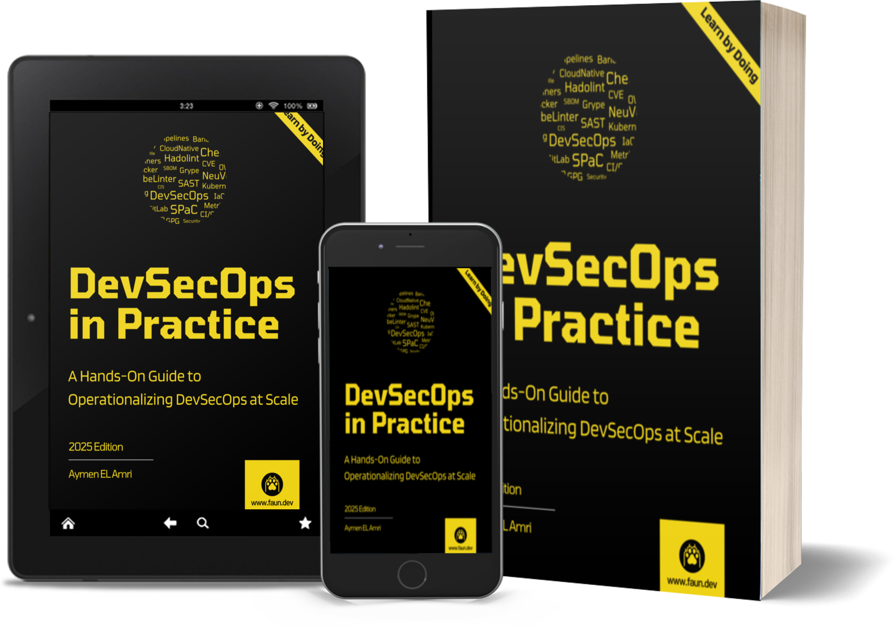

# DevSecOps in Practice - A Hands-On Guide to Operationalizing DevSecOps at Scale

This repository contains the code snippets and images used in the book *DevSecOps in Practice - A Hands-On Guide to Operationalizing DevSecOps at Scale*.

## Who This Guide is For

I often use the word "developer" to refer to anyone who is involved in the software development lifecycle: developers, operations engineers, security engineers, and anyone else who is involved in delivering software. Not because I think that everyone should be a developer, but to avoid using multiple terms that can be long and cumbersome. However, I firmly believe that everyone involved in creating, deploying, and maintaining software should be an **engineer** and it's not a matter of diploma or degree but of mindset. 

In my deeply held opinion, an engineer is someone who is able to take a problem, break it down into smaller pieces, solve each piece separately, then plays an active role at every stage to bring the greatest value to the solution. Perhaps I'm biased, but an engineer's mark is felt across every phase of the lifecycle—each step bearing their distinctive imprint. What happens when security engineers can't code, developers overlook security, or operations engineers don't grasp either domain? You end up with silos, blind spots, and vulnerabilities—a recipe for disaster waiting to happen.

The good news is that DevSecOps is designed precisely to break down those dangerous silos and blind spots. It doesn't demand that you know everything from day one, but rather encourages you to embrace learning through action. Think of it less like reading a textbook and more like mastering an instrument: the more you practice, the more proficient you become.

Details matter deeply in DevSecOps. Every configuration, every line of code, every automated script—they all carry weight and meaning. Small oversights can compound into significant vulnerabilities, while attention to detail can build remarkably resilient software. *DevSecOps in Practice - A Hands-On Guide to Operationalizing DevSecOps at Scale* isn't a mere collection of theories or abstract concepts—it's a toolkit designed for action. It embodies the "just do it" philosophy, guiding you step-by-step to engage actively, to build confidence through hands-on experience, and to recognize the critical details that shape secure, efficient software.

*DevSecOps in Practice* is for every developer, operations engineer, security engineer, and anyone else involved in the software development lifecycle who wants to get their hands dirty, learn from each step, and most importantly—start building. Because when you "just do it," you don't only learn faster; you also create solutions that are robust, resilient, and secure from the ground up.

You don't need to be a security expert to start implementing the practices in this guide. The code snippets and examples are designed to be easy to understand and follow, the security concepts are explained in a way that is accessible to everyone, the tools used are open-source and widely and the infrastructure is accessible to everyone.

DevSecOps is not a role but an set of practices to implement continuous security that covers the entire SDLC and it's the responsability of security engineers, system administrators, operation engineers, developers, architects, network engineers, and all IT professionals. *DevSecOps in Practice* is designed to be accessible to all these roles.

## What You Will Learn

Putting DevSecOps into practice at a scale is not an easy task and requires a shift in mindset, culture, and processes. However, taking the whole problem apart and addressing each piece separately can make it easier to implement. Taking a step back and looking at the big picture is important but not at the expense of the details - it's not enough to have the high-level view of the problem and if it's the only thing you have, chances are you will miss the details that are important to make it work. 

Charles Eames said: "The details are not the details. They make the design." This is true for DevSecOps as well. The details are what make DevSecOps work and if you don't pay attention to them, you will end up with a broken implementation that doesn't deliver the expected results. This guide is designed to help you with that through a series of chapters that cover different stages and aspects of the process. In this guide, you will understand the following concepts:

- The **DevSecOps** philosophy, mindset and practices.

- Establishing a secure and structured Git workflow for collaboration, managing repositories safely, ignoring sensitive data, and rewriting Git history to remove leaked secrets.

- Implementing robust security practices for your Git repositories, including access controls, branch protection, commit signing with GPG keys, secure authentication using SSH keys, and more.

- Preventing and detecting secret leaks proactively through tools like **TruffleHog**, implementing **pre-commit hooks**, and using scanning tools for secrets management.

- Scanning dependencies for vulnerabilities using **OWASP Dependency-Check** and understanding **CVEs**, **CVSS**, **CWE**, and **CPE identifiers** to keep your software supply chain secure.

- Improving your code quality and security using security linting tools like **Bandit**, identifying issues such as SQL injections, insufficient input validation, improper error handling, insecure deserialization, and weak cryptographic practices.

- **Security linting** your **Dockerfiles** using tools like **Hadolint** to catch common issues like overly permissive configurations and insecure instructions.

- Building **secure container images** with best practices for writing **Dockerfiles** and managing Docker registries, including using multi-stage builds, setting proper user permissions, and avoiding pitfalls.

- Scanning your Docker images for vulnerabilities using container-scanning tools like **Trivy**, interpreting scan reports, and applying findings proactively.

- Setting up and securing your **Kubernetes** infrastructure using **Infrastructure as Code (IaC)** techniques and tools like **Terraform**.

- Implementing **immutable infrastructure** principles to reduce configuration drift, minimize your attack surface, enforce security compliance automatically, and speed up vulnerability response.

- Managing your infrastructure securely with Terraform, analyzing IaC files using security-focused tools such as **Checkov**, and addressing common security issues like permissive IAM roles, unencrypted resources, and publicly accessible resources.

- Creating and deploying secure Kubernetes manifests, including detailed steps for avoiding common pitfalls.

- Conducting security analyses of your Kubernetes manifests using static analysis tools like **KubeLinter** to enforce secure defaults and compliance requirements.

- Building and managing your **Software Bill of Materials (SBOM)** using tools like **Syft** and **OWASP DependencyTrack** to improve your software supply chain security.

- Implementing proactive and continuous security through **Security Policy as Code (SPaC)** using tools such as **NeuVector**, enforcing compliance standards, vulnerability management, and creating automated response rules and policies.

- Building **end-to-end continuous security** and proactive security practices into your DevOps and DevSecOps processes.

- Building **real-world DevSecOps pipelines** using **GitLab CI** enforcing and reporting security policies, scanning for vulnerabilities, preventing secret leaks, linting code, detecting misconfigurations, preventing supply chain attacks, generating SBOMs and more.

By the end of this guide, you'll possess not only a robust grasp of DevSecOps fundamentals, but also the tactical know-how to embed security into your delivery pipelines. You'll be equipped to architect fortified, comprehensive CI/CD flows that span from ideation to deployment. More importantly, you’ll cultivate the foresight to intercept security flaws at their source—minimizing exposure.

Transforming security from a checkpoint into a catalyst for velocity is no small feat. *DevSecOps in Practice* has been meticulously crafted to empower you with the tools, techniques, and mindset to make this transformation a reality.

## About the Author

Aymen El Amri is a software engineer, trainer, author, and entrepreneur. He is the founder of the [FAUN Developer Community](https://faun.dev/). He is the author of multiple books on software engineering. You can find him on [Twitter](https://twitter.com/eon01) and [LinkedIn](https://www.linkedin.com/in/elamriaymen/).

## Join the Community

This guide was published by FAUN, a community of developers and engineers who are passionate about learning and sharing their knowledge. If you're interested in joining us, you can start by subscribing to our newsletter at [faun.dev/join](https://faun.dev/join). Every week, we share the most important and relevant articles, tutorials, and videos on the latest technologies and trends, including cloud-native, DevSecOps, automation, and more.

You can also follow us on Twitter at [@joinFAUN](https://twitter.com/joinFAUN) and [LinkedIn](https://www.linkedin.com/company/22322295) to stay up-to-date with the latest news and announcements.

## Your Feedback Matters

Countless hours have been poured into preparing and developing *End-to-End Kubernetes with Rancher, RKE2, K3s, Fleet, Longhorn, and NeuVector*, aiming to provide you with the best knowledge and tools to master this powerful ecosystem. Your feedback is invaluable to me.

I would love to hear your thoughts and suggestions. Your feedback will help me improve this guide and create better content in the future. Your insights could also light the way for others! If you feel I've achieved my goal and this guide has been valuable to you, I'd be deeply honored if you shared your experience with a thoughtful review on the marketplace where you acquired this book, on social media, or directly with me via email (community@faun.dev).

Your feedback will help me quantify the impact of this work and help others discover it and benefit from the knowledge within.

The author.
